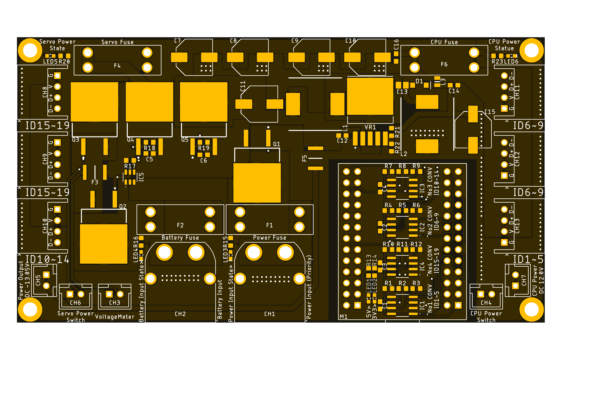

<html lang="en">
  <head>
    <meta charset="uft-8">
    <meta name="author" content="Masato Kubotera">
  </head>
  <body>
    <h1>Main Board Ver. 2.2</h1>
    <h2>About Main Board</h2>
    

      The Main Board is a single board that integrates the circuits for driving the robot designed to be mounted on SUSTAINA-OP.
       
       
      Note that this is Ver. 2.2. For other versions, please refer to the following repositories.
      <ul>
        <li><a href="https://github.com/MasatoKubotera/MainBoard_ver2_0">Main Board Ver. 2.0</a></li>
        <li><a href="https://github.com/MasatoKubotera/MainBoard_ver2_1">Main Board Ver. 2.1</a></li>
      </ul>
      <h2>About Ver. 2.2</h2>
      now writing...
        
      It is actually used for the 6th generation robot SUSTAINA-OP of the RoboCup Humanoid League team CIT Brains competed in the RoboCup 2022.  
      <!--
      -->
      <table>
        <tr>
          <td>
            <a href="image/brd_top.png">
              

                
              

            </a>
          </td>
          <td>
            

              
            

          </td>
          <td>
            

              
            

          </td>
        </tr>
        <tr>
          <td>
            

              PCB preview image
            

          </td>
          <td>
            

              After mounting electronic components
            

          </td>
          <td>
            

              After attaching module board
            

          </td>     
        </tr>
      </table>
    

    <h2>Repository Contents</h2>
    

    <dl>
      <dt>\image</dt>
      <dd>PCB preview images and capture of design screen</dd>
      <dt>\libraries</dt>
      <dd>Libraries used in Autodesk Eagle design</dd>
      <dt>Schematic.pdf</dt>
      <dd>Circuit diagram of this product</dd>
      <dt>BOM.txt</dt>
      <dd>Parts lists output from design data</dd>
      <dt>.brd</dt>
      <dd>Board wiring design file by Autodesk Eagle</dd>
      <dt>.sch</dt>
      <dd>Schematic design file by Autodesk Eagle</dd>
      <dt>Gerber_data.zip</dt>
      <dd>Zip folder of Gerber format files for PCB manufacturing requests.</dd>
      <dt>LICENSE</dt>
      <dd>This is a license to use this product. Please confirm before use.</dd>
      <dt>.gitignore</dt>
      <dd>File to exclude cache files from management.</dd>
    </dl>
    

    <h2>Documentation</h2>
      

        <h3>BOM</h3>
        The BOM below shows the components actually mounted on the SUSTAINA-OP equipped MainBoard in RoboCup2022. Many of these boards have been created, and in some cases substitutes have been used. Their details are listed below the BOM.
          <table>
            <thead>
              <tr>
                <th> Eagle Design Parts # </th>
                <th> Q'ty </th>
                <th> Mfr. Product # </th>
                <th> Supplier </th>
                <th> Description </th>
              </tr>
            </thead>
            <tbody>
              <tr>
                <td>C1, C2, C3, C4, C5, C6</td>
                <td>6</td>
                <td>C1608JB1H104K</td>
                <td><a href="https://akizukidenshi.com/catalog/g/gP-06166/">Akizuki</a></td>
                <td>Multilayer Ceramic Capacitors SMD/SMT 0.1uF 50V 10% 0603</td>
              </tr>
              <tr>
                <td>C11,C15</td>
                <td>2</td>
                <td>UWT1E221MNL1GS</td>
                <td><a href="https://akizukidenshi.com/catalog/g/gP-10420/">Akizuki</a></td>
                <td>Aluminum Electrolytic Capacitors SMD/SMT 220uF 25V 20% AEC-Q200</td>
              </tr>
              <tr>
                <td>C12,C14</td>
                <td>2</td>
                <td>GRM188R71E105KA12</td>
                <td><a href="https://akizukidenshi.com/catalog/g/gP-14526/">Akizuki</a></td>
                <td>Multilayer Ceramic Capacitors SMD/SMT 1uF 25V 10% 0603</td>
              </tr>
              <tr>
                <td>C13</td>
                <td>1</td>
                <td>GRM21BR61E226ME44</td>
                <td><a href="https://akizukidenshi.com/catalog/g/gP-08240/">Akizuki</a></td>
                <td>Multilayer Ceramic Capacitors SMD/SMT 22uF 25V 15% 0603</td>
              </tr>
              <tr>
                <td>C16</td>
                <td>1</td>
                <td>GRM188R6YA106MA73</td>
                <td><a href="https://akizukidenshi.com/catalog/g/gP-13161/">Akizuki</a></td>
                <td>Multilayer Ceramic Capacitors SMD/SMT 10uF 35V 20% 0603</td>
              </tr>
              <tr>
                <td>C7, C8, C9, C10</td>
                <td>4</td>
                <td>35PFV150M8X10.5</td>
                <td><a href="https://akizukidenshi.com/catalog/g/gP-14492/">Akizuki</a></td>
                <td>Aluminum Organic Polymer Capacitors SMD/SMT 150uF 35V 20% AEC-Q200</td>
              </tr>
              <tr>
                <td>CH1, CH2</td>
                <td>2</td>
                <td>XT60PW-M</td>
                <td><a href="https://store.shopping.yahoo.co.jp/suzakulab/amass-xt60pw-m.html">Suzaku Lab.</a></td>
                <td>DC Power Connector, Through Hole, Horizontal, Male, 30A 500V</td>
              </tr>
              <tr>
                <td>CH3</td>
                <td>1</td>
                <td>B2B-XH-A-BLACK</td>
                <td><a href="https://www.daisen-netstore.com/shopdetail/000000000029/ct15/page1/order/">DAISEN</a></td>
                <td>Connector Header Through Hole, Top entry 2 position 2.54mm BLACK</td>
              </tr>
              <tr>
                <td>CH4</td>
                <td>1</td>
                <td>B2B-XH-A-BLUE</td>
                <td><a href="https://www.daisen-netstore.com/shopdetail/000000000029/ct15/page1/order/">DAISEN</a></td>
                <td>Connector Header Through Hole, Top entry 2 position 2.54mm BLUE</td>
              </tr>
              <tr>
                <td>CH5</td>
                <td>1</td>
                <td>B2B-XH-A-GREEN</td>
                <td><a href="https://www.daisen-netstore.com/shopdetail/000000000029/ct15/page1/order/">DAISEN</a></td>
                <td>Connector Header Through Hole, Top entry 2 position 2.54mm GREEN</td>
              </tr>
              <tr>
                <td>CH6</td>
                <td>1</td>
                <td>B2B-XH-A-YELLOW</td>
                <td><a href="https://www.daisen-netstore.com/shopdetail/000000000029/ct15/page1/order/">DAISEN</a></td>
                <td>Connector Header Through Hole, Top entry 2 position 2.54mm YELLOW</td>
              </tr>
              <tr>
                <td>CH7</td>
                <td>1</td>
                <td>B2B-XH-A-RED</td>
                <td><a href="https://www.daisen-netstore.com/shopdetail/000000000029/ct15/page1/order/">DAISEN</a></td>
                <td>Connector Header Through Hole, Top entry 2 position 2.54mm RED</td>
              </tr>
              <tr>
                <td>CH8, CH9</td>
                <td>2</td>
                <td>S4B-XH-A(LF)(SN)-YELLOW</td>
                <td><a href="https://www.daisen-netstore.com/shopdetail/000000000028/ct15/page1/order/">DAISEN</a></td>
                <td>Connector Header Through Hole, Side entry 4 position 2.54mm YELLOW</td>
              </tr>
              <tr>
                <td>CH10</td>
                <td>1</td>
                <td>S4B-XH-A(LF)(SN)-GREEN</td>
                <td><a href="https://www.daisen-netstore.com/shopdetail/000000000028/ct15/page1/order/">DAISEN</a></td>
                <td>Connector Header Through Hole, Side entry 4 position 2.54mm GREEN</td>
              </tr>
              <tr>
                <td>CH11, CH12</td>
                <td>2</td>
                <td>S4B-XH-A(LF)(SN)-BLUE</td>
                <td><a href="https://www.daisen-netstore.com/shopdetail/000000000028/ct15/page1/order/">DAISEN</a></td>
                <td>Connector Header Through Hole, Side entry 4 position 2.54mm BLUE</td>
              </tr>
              <tr>
                <td>CH13</td>
                <td>1</td>
                <td>S4B-XH-A(LF)(SN)-RED</td>
                <td><a href="https://www.daisen-netstore.com/shopdetail/000000000028/ct15/page1/order/">DAISEN</a></td>
                <td>Connector Header Through Hole, Side entry 4 position 2.54mm RED</td>
              </tr>
              <tr>
                <td>D1</td>
                <td>1</td>
                <td>SS34FA</td>
                <td><a href="https://www.mouser.jp/ProductDetail/512-SS34FA">Mouser</a></a></td>
                <td>Schottky Barrier Rectifiers SMD/SMT 3 A 40 V</td>
              </tr>
              <tr>
                <td>F1, F2, F4</td>
                <td>3</td>
                <td>0891020.NXS</td>
                <td><a href="https://www.mouser.jp/ProductDetail/576-0891020.NXS">Mouser</a></td>
                <td>Automotive Fuses LP MINI 58V 20A</td>
              </tr>
              <tr>
                <td>F1, F2, F4, F6</td>
                <td>4</td>
                <td>3557-2</td>
                <td><a href="https://www.mouser.jp/ProductDetail/534-3557-2">Mouser</a></td>
                <td>Fuse Holder Through Hole 500V 30A</td>
              </tr>
              <tr>
                <td>F3</td>
                <td>1</td>
                <td>MF-MSMF010</td>
                <td><a href="https://akizukidenshi.com/catalog/g/gP-15428/">Akizuki</a></td>
                <td>PTC Resettable Fuses SMD/SMT 0.1A 60V 1812</td>
              </tr>
              <tr>
                <td>F5</td>
                <td>1</td>
                <td>MF-MSMF050/30X-2</td>
                <td><a href="https://www.mouser.jp/ProductDetail/652-MF-MSMF050/30X-2">Mouser</a></td>
                <td>PTC Resettable Fuses SMD/SMT 0.5A 30V 1812</td>
              </tr>
              <tr>
                <td>F6</td>
                <td>1</td>
                <td>MO-29</td>
                <td><a href="https://www.amazon.co.jp/dp/B0722VT9DQ/">Amazon</a></td>
                <td>Automotive Fuses LP MINI 7.5A</td>
              </tr>
              <tr>
                <td>IC1, IC2, IC3, IC4</td>
                <td>4</td>
                <td>ADM3078EARZ</td>
                <td><a href="https://www.mouser.jp/ProductDetail/584-ADM3078EARZ">Mouser</a></td>
                <td>3.3 V, ±15 kV ESD-Protected, Half- and Full-Duplex, RS-485/RS-422 Transceivers</td>
              </tr>
              <tr>
                <td>IC5</td>
                <td>1</td>
                <td>LTC4412ES6</td>
                <td><a href="https://akizukidenshi.com/catalog/g/gI-07305/">Akizuki</a></td>
                <td>PMIC Low Loss PowerPath Controller</td>
              </tr>
              <tr>
                <td>L1,L2</td>
                <td>2</td>
                <td>CDRH127/LDNP-470MC</td>
                <td><a href="https://akizukidenshi.com/catalog/g/gP-13966/">Akizuki</a></td>
                <td>Power Inductors - SMD 47uH 3.25A</td>
              </tr>
              <tr>
                <td>L3</td>
                <td>1</td>
                <td>DFE201210S-2R2M</td>
                <td><a href="https://akizukidenshi.com/catalog/g/gP-14976/">Akizuki</a></td>
                <td>Power Inductors - SMD 2.2 uH 1.5A</td>
              </tr>
              <tr>
                <td>LED1,LED2,LED3,LED4</td>
                <td>4</td>
                <td>150060VS86000</td>
                <td><a href="https://www.mouser.jp/ProductDetail/710-150060VS86000">Mouser</a></td>
                <td>Standard LEDs - SMD Green 2V 20mA 573nm 0603</td>
              </tr>
              <tr>
                <td>LED5,LED6</td>
                <td>2</td>
                <td>150060YS75000</td>
                <td><a href="https://www.mouser.jp/ProductDetail/710-150060YS75000">Mouser</a></td>
                <td>Standard LEDs - SMD Yellow 2V 20mA 590nm 0603</td>
              </tr>
              <tr>
                <td>M1</td>
                <td>1</td>
                <td>FT4232H MINI MODULE</td>
                <td><a href="https://www.mouser.jp/ProductDetail/895-FT4232HMINIMOD">Mouser</a></td>
                <td>Interface Development Tools USB Hi-Speed FT4323H Evaluation Module</td>
              </tr>
              <tr>
                <td>M1</td>
                <td>2</td>
                <td>FH-2x13SG</td>
                <td><a href="https://akizukidenshi.com/catalog/g/gC-00084/">Akizuki</a></td>
                <td>2.54mm Pin Socket, 2 Row, 26 Pin</td>
              </tr>
              <tr>
                <td>Q1, Q2, Q3, Q4, Q5</td>
                <td>5</td>
                <td>SQM40P10-40L_GE3</td>
                <td><a href="https://www.mouser.jp/ProductDetail/78-SQM40P10-40L_GE3">Mouser</a></td>
                <td>Pch MOSFET 100V 40A 150W 33mohm</td>
              </tr>
              <tr>
                <td>R1, R3, R4, R6, R7, R9, R10, R12</td>
                <td>8</td>
                <td>RC0603FR-10680RL</td>
                <td><a href="https://www.mouser.jp/ProductDetail/603-RC0603FR-10680RL">Mouser</a></td>
                <td>Thick Film Resistors - SMD 680 Ohms 100-200mW 1% 0603</td>
              </tr>
              <tr>
                <td>R13, R14, R22</td>
                <td>3</td>
                <td>RC0603FR-101KL</td>
                <td><a href="https://www.mouser.jp/ProductDetail/603-RC0603FR-101KL">Mouser</a></td>
                <td>Thick Film Resistors - SMD 1 kOhms 100-200mW 1% 0603</td>
              </tr>
              <tr>
                <td>R15, R16, R20, R23</td>
                <td>4</td>
                <td>RC0603FR-102KL</td>
                <td><a href="https://www.mouser.jp/ProductDetail/603-RC0603FR-102KL">Mouser</a></td>
                <td>Thick Film Resistors - SMD 2 kOhms 100-200mW 1% 0603</td>
              </tr>
              <tr>
                <td>R17</td>
                <td>1</td>
                <td>RC0603FR-10470KL</td>
                <td><a href="https://www.mouser.jp/ProductDetail/603-RC0603FR-10470KL">Mouser</a></td>
                <td>Thick Film Resistors - SMD 470 kOhms 100-200mW 1% 0603</td>
              </tr>
              <tr>
                <td>R21</td>
                <td>1</td>
                <td>RC0603FR-078K66L</td>
                <td><a href="https://www.mouser.jp/ProductDetail/603-RC0603FR-078K66L">Mouser</a></td>
                <td>Thick Film Resistors - SMD 8.66 kOhms 100-200mW 1% 0603</td>
              </tr>
              <tr>
                <td>R18, R19</td>
                <td>2</td>
                <td>RC0603FR-1010KL</td>
                <td><a href="https://www.mouser.jp/ProductDetail/603-RC0603FR-1010KL">Mouser</a></td>
                <td>Thick Film Resistors - SMD 10 kOhms 100-200mW 1% 0603</td>
              </tr>
              <tr>
                <td>R2, R5, R8, R11</td>
                <td>4</td>
                <td>RC0603FR-10120RL</td>
                <td><a href="https://www.mouser.jp/ProductDetail/603-RC0603FR-10120RL">Mouser</a></td>
                <td>Thick Film Resistors - SMD 120 Ohms 100-200mW 1% 0603</td>
              </tr>
              <tr>
                <td>VR1</td>
                <td>1</td>
                <td>XL6009E1</td>
                <td><a href="https://www.aitendo.com/product/10307">Aitendo</a></td>
                <td>400KHz 60V 4A Switching Current Boost / Buck-Boost / Inverting DC/DC Converter</td>
              </tr>
            </tbody>
          </table>
          

            
Substitutes

            Used for No. 1 ~ No. 7
            <table>
              <thead>
                <tr>
                  <th> Eagle Design Parts # </th>
                  <th> Q'ty </th>
                  <th> Mfr. Product # </th>
                  <th> Supplier </th>
                  <th> Description </th>
                </tr>
              </thead>
              <tbody>
                <tr>
                  <td>C1, C2, C3, C4, C5, C6</td>
                  <td>6</td>
                  <td>GCM188L81H104K57</td>
                  <td><a href="https://akizukidenshi.com/catalog/g/gP-16143/">Akizuki</a></td>
                  <td>Multilayer Ceramic Capacitors SMD/SMT 0.1uF 50V 10% 0603</td>
                </tr>
              </tbody>
            </table>
            Used for No. 13 ~ 
            <table>
              <thead>
                <tr>
                  <th> Eagle Design Parts # </th>
                  <th> Q'ty </th>
                  <th> Mfr. Product # </th>
                  <th> Supplier </th>
                  <th> Description </th>
                </tr>
              </thead>
              <tbody>
                <tr>
                  <td>Q1, Q2, Q3, Q4, Q5</td>
                  <td>5</td>
                  <td>SUM110P06-08L-E3</td>
                  <td><a href="https://www.mouser.jp/ProductDetail/781-SUM110P06-08L-E3">Mouser</a></td>
                  <td>Pch MOSFET 60V 110A 272W 8.0mohm</td>
                </tr>
              </tbody>
            </table>
          
  
        <h3>PCB Fabrication</h3>
          PCB(Printed Circuit Board) manufacturing was outsourced to <a href="https://www.elecrow.com/pcb-manufacturing.html">Elecrow</a>. 
          The custom specifications are as follows.
          <ul>
            <li>Layer : 2 layers</li>
            <li>Dimensions : 120 x 65</li>
            <li>Different PCB Design : 1eg</li>
            <li>PCB Thickness : 1.6</li>
            <li>PCB Color : Black</li>
            <li>Surface Finish : HASL Lead Free</li>
            <li>Castellated Hole : No</li>
            <li>Copper Weight : 2oz</li>
            <li>PCB Stencil : Stencil 15cm X 15cm no frame</li>
            <li>Stencil Side : Top</li>
          </ul>
          The data used to order fabrication are as follows.
          <ul>
            <li>Eagle design rule : <a href="https://www.elecrow.com/download/Elecrow_PCB_eagle_rule.zip">Elecrow Eagle Design Rule</a></li>
            <li>Eagle CAM file : <a href="https://www.elecrow.com/download/Elecrow_Gerber_Generater_DrillAlign.zip">Elecrow CAM file</a></li>
            <li>Gerber format data : <a href="/Gerber_data.zip">Gerber_data.zip</a></li>
          </ul>
        <h3>Issues with this board</h3>
        <ul>
          <li>Heat generation problem of FETs</li>
          <li>Poor inrush current protection by load switch circuit</li>
        </ul>
        <h3>References</h3>
        <ul>
          <li> 4-Parallel Servo Motor Control with FT4232H MINI MODULE
            <ul>
              <li> <a href=""https://2019.robocup.org/downloads/program/BestmannEtAl2019.pdf">Bestmann, Marc & Güldenstein, Jasper & Zhang, Jianwei. (2019). High-Frequency Multi Bus Servo and Sensor Communication Using the Dynamixel Protocol. </a></li>
              <li> Wolfgang CORE : https://github.com/bit-bots/wolfgang_core</li>
             </ul>
          </li>
        </ul>
      

    <h2>Contact</h2>
    

    If you have any questions, please contact MasatoKubotera, the product's designer, by E-mail. 
    E-mail : <a href="mailto:masatokubotera06@yahoo.co.jp">masatokubotera06@yahoo.co.jp</a>
    

    <h2>License Information</h2>
    

      This product is open source. 
      Please review the <a href="/LICENSE">LICENSE file</a> for license information. 
       
      <strong>Main Board Ver. 2.2</strong> by Masato Kubotera is licensed under a <a href="http://creativecommons.org/licenses/by-nc-sa/4.0/">Creative Commons Attribution-NonCommercial-ShareAlike 4.0 International License</a>.
    
    
  </body>
</html>
